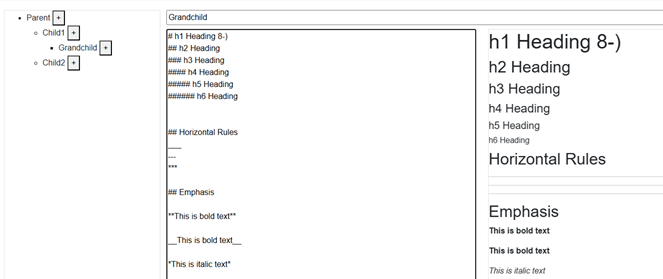

#  Pinetree
## Pinetree is browser-based hierarchical markdown editor

# 👉 What Is a "Hierarchical" Markdown Editor?
- Pinetree draws inspiration from Amazon's "One-Pager" culture, which emphasizes summarizing key points concisely on a single page. While people prefer short and readable content, there are times when they seek more detailed information.

- As detailed content accumulates, we often organize it using rules or folders. However, traditional file structures lack inherent connections between such documents. Pinetree allows you to represent text in a "hierarchical" manner, enabling navigation through links. This helps readers naturally understand the relationships between different parts of the text.

- Pinetree is ideal for documents that require both brevity and detail, such as travel plans, resumes, or reading notes. You can keep each piece of writing simple while adding detailed layers hierarchically as needed. Experience this new style of writing for yourself.

#  🖼️ My Ultimate Markdown Editor
- I love Markdown, especially editors that display the text on the left and a preview on the right. Editors like GitHub, where the preview opens in a separate tab, make it harder to view both simultaneously. Similarly, tools like Notion or Discord allow Markdown-style writing but don't let you revert to the original format, which I find less satisfactory.

- When writing in Markdown, ease of use is crucial. For instance, typing "-" or "1." and pressing enter should automatically continue the list. The tab key should insert two spaces. Since I don't remember all Markdown syntax, having a toolbar instead of relying solely on help documentation is extremely helpful. Inserting images should also be straightforward.

- While this Markdown editor isn't perfect yet, it includes all the features I desire. Being able to write in this style with a hierarchical structure makes it my ideal Markdown editor.

# 📊 Writing Becomes More Flexible with Hierarchies
- While developing Pinetree, I realized that hierarchical text structures are beneficial in many scenarios. As you write more, the content naturally becomes longer vertically. Take reading notes, for example. As you summarize content, the notes grow longer, making it cumbersome to scroll through later. By dividing the text into meaningful units (e.g., by chapters), you reduce the amount to read at once, making it easier to understand.

- Some texts are inherently suited to hierarchical organization from the start, such as diaries or blogs recorded by date. Managing a month's worth of diary entries can be challenging, but grouping them by weeks ("Week 1" to "Week 4") and then compiling them into a monthly unit like "March" is possible. Alternatively, you can structure a single file with 12 months' worth of hierarchies. There's no single "correct structure" for text. The strength of hierarchical organization lies in its flexibility to adapt based on purpose and volume.

- Hierarchical structures are also suitable for travel planning. Travel content doesn't always follow a chronological order. Ideas like "I want to visit X on the third day" often change during the planning process. Initially, a single text file may suffice, but as information accumulates, you'll want to organize it into "chunks." Just like using tabbed notebooks to separate pages, organizing content hierarchically makes the overall view clearer. While it may not be perfectly orderly, having a structure certainly aids comprehension.

# 🙏 We Welcome Your Feedback
- Pinetree has now implemented the minimum features I needed in a hierarchical Markdown editor. I've started using it daily, but I'm eager to hear opinions from others.

- I'm particularly interested in feedback on "hierarchical text," whether positive or negative. Currently, to maintain the simplicity of a One-Pager, there are restrictions on hierarchy depth, the number of files, and the number of input characters. I'd like to know if these limitations are appropriate. In the future, if there's a need to exceed these limits, I'm considering introducing a paid plan.

- Feedback can be sent through the official website, but for more casual communication, we recommend our Discord. We're also considering offering lifetime free access to those who provide valuable feedback!
